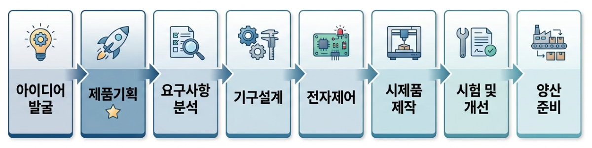

제품기획은 철저한 요구사항 분석을 바탕으로 정확한 개발 방향을 결정하는 하드웨어 개발의 첫 단추입니다. 이 단계가 탄탄해야 이후의 기구설계, 전자제어, 자동화기술, 제조기술 공정으로 완벽하게 이어질 수 있습니다.
 
---
 
## 🛠️ 제품기획부터 양산까지의 개발 프로세스

성공적인 하드웨어 개발을 위해 신성테크가 준수하는 체계적인 가로형 선순환 공정입니다.

 
---
 
## 제품기획의 목적 및 중요성

초기 기획이 부실하면 기구설계나 전자제어 단계에서 설계가 뒤엎어지는 최악의 상황(일정 지연, 비용 폭증)이 발생할 수 있습니다. 기획 단계에서 충분한 검토를 거치면 불필요한 수정 비용을 극적으로 줄이고 제품 경쟁력을 확보할 수 있습니다.

* **명확한 제품 개발 방향 설정 및 핵심 기능 정의**
* **목표 시장 및 타겟 사용자 환경 분석**
* **현실적인 개발 일정, 예산, 제조 원가 검토**
* **생산성과 유지보수 편의성을 고려한 영리한 설계 기반 구축**
 
---
 
## 마무리

체계적인 제품기획은 개발 기간과 비용을 줄이고 완제품의 완성도를 높이는 가장 확실한 방법입니다. 

신성테크는 수많은 시제품 제작 및 양산 개발 경험을 바탕으로, 제품기획부터 설계, 자동화 적용까지 귀사의 아이디어를 가장 효율적인 프로세스로 실현해 드립니다. 궁금하신 점이 있다면 언제든 편하게 문의해 주시기 바랍니다.
